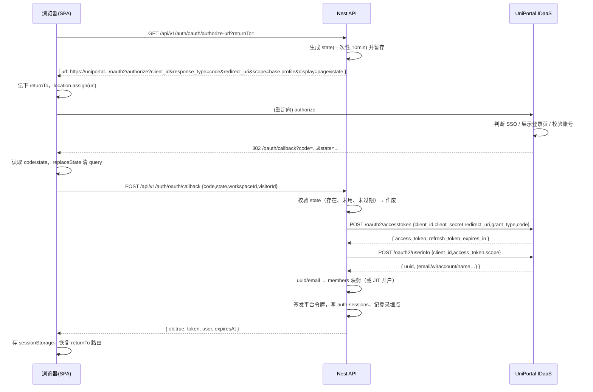

# 登录改造方案设计 · 开发用账号密码 / 测试生产用 UniPortal OAuth2

> 状态：**已实现，待内网联调**（分支 `jianghong`，2026-09-20）
> 部署与排障：[auth-oauth-troubleshooting.md](auth-oauth-troubleshooting.md)
> 配置模板：`deploy/oauth.env.example` → `apps/api/.env.oauth`
> 范围：`apps/web` 登录入口与会话装载、`apps/api` `/api/v1/auth/*`、部署与配置
> 目标：**开发环境保留账号密码登录，测试与生产环境统一走 IDaaS（UniPortal）OAuth2 授权码流程**，且两条路径共用同一套会话与 RBAC。

---

## 1. 结论先行

1. **不新建第二套会话体系**。OAuth 只替换"如何证明你是谁"这一段；证明完成后仍由 Nest 签发现有的平台令牌（`auth-sessions` 文档 + `Authorization: Bearer`），`/auth/me`、跨工作区复用、RBAC、游客态全部不动。
2. **授权码换令牌必须在 Nest 侧完成**。`client_secret` 不能进 SPA 产物，`/oauth2/accesstoken` 与 `/oauth2/userinfo` 都由后端发起。
3. **登录模式由服务端决定，前端只读取**。同一份前端产物在测试/生产可复用，前后端不会配歪。
4. **切到 oauth 模式后必须同时关死密码通道**（后端 `POST /auth/login` 拒绝 + 演示口令关闭 + 前端离线兜底登录禁用），否则 SSO 形同虚设——这是本次改造最关键的一条。
5. **不做"未登录即自动跳转授权"**。本平台有一等公民的游客态（`sessionStore.enterGuest`），自动跳转会破坏游客浏览，并与 SSO 登出形成回跳死循环。改为用户点"登录"才跳。

---

## 2. 现状（代码事实）

| 环节 | 现状 | 位置 |
|------|------|------|
| 登录表单 | 邮箱 + 密码，全屏页与登录墙浮层共用一份 | [LoginForm.tsx](../apps/web/src/features/auth/LoginForm.tsx)、[LoginPage.tsx](../apps/web/src/features/auth/LoginPage.tsx)、[AuthGateOverlay.tsx](../apps/web/src/features/auth/AuthGateOverlay.tsx) |
| 前端会话 | `login/logout/hydrateFromServer`；令牌存 `sessionStorage.mssclaw_auth_token` | [sessionStore.ts](../apps/web/src/stores/sessionStore.ts) |
| 令牌透传 | `Authorization: Bearer` + `X-Session-Token` | [client.ts:108](../apps/web/src/api/client.ts:108) |
| 后端接口 | `POST /api/v1/auth/login`、`GET /auth/me`、`POST /auth/logout` | [platform-docs.controller.ts:135](../apps/api/src/persistence/platform-docs.controller.ts:135) |
| 口令校验 | `members` 文档查人 + `auth-credentials` 文档校验 salt/hash，或演示口令 `mssclaw` | [platform-docs.service.ts:1362](../apps/api/src/persistence/platform-docs.service.ts:1362) |
| 会话存储 | `auth-sessions` 文档，随机 24 字节 hex，有效期 7 天，带 `auth` 来源指纹 | 同上 `putSession` |
| 身份还原 | `me()` 按目标工作区 `members` 重建身份与角色 | [platform-docs.service.ts:1445](../apps/api/src/persistence/platform-docs.service.ts:1445) |
| 离线兜底 | API 不可达时走前端本地账号表登录 | [authAccounts.ts](../apps/web/src/domain/authAccounts.ts) |
| 路由 | Hash 路由（`#/home`），Nginx `try_files … /index.html` | [appRoute.ts](../apps/web/src/domain/appRoute.ts)、[nginx.mssclaw.conf.example](../deploy/nginx.mssclaw.conf.example) |
| 环境区分 | vite `--mode local/test/production`；API `start-api.mjs <local\|test\|production>` | 根 `package.json`、[start-api.mjs](../apps/api/scripts/start-api.mjs) |

**可直接复用的部分**：令牌签发/校验/登出、跨工作区会话复用、`me()` 重建身份、游客态、登录埋点 `recordDailyLogin`。
**需要新增的部分**：授权 URL 生成、`state` 管理、授权码换令牌、uuid→成员映射、登录模式下发、SSO 登出跳转。

---

## 3. 总体方案

### 3.1 双模式开关

引入服务端单一事实源 `AUTH_MODE`：

| 环境 | `AUTH_MODE` | 登录方式 |
|------|-------------|----------|
| 本地开发 `local` | `password` | 邮箱 + 密码（现状不变） |
| 测试 `test` | `oauth` | UniPortal beta 授权码流程 |
| 生产 `production` | `oauth` | UniPortal 生产授权码流程 |

前端在启动探活时读取模式，不把模式编进产物：

- 扩展现有 `GET /api/v1/health` 返回 `auth: { mode, providerLabel }`，复用 [App.tsx](../apps/web/src/App.tsx) 已有的 `fetchApiHealthInfo()` 调用，**不增加首屏请求**。
- 另提供 `GET /api/v1/auth/config`（免鉴权）供直连调试与 E2E 使用，返回同一份结构。
- 兜底顺序：`VITE_AUTH_MODE` 显式覆盖 > 服务端下发 > `password`。静态托管 / `isApiEnabled() === false` 时恒为 `password`（无后端即无 OAuth）。

> 为什么不用 `VITE_AUTH_MODE` 直接编译进去：测试与生产共用同一次 `build:react`，模式随部署配置走；且前端单方面切模式会出现"前端显示 SSO、后端仍收密码"的错配。`VITE_AUTH_MODE` 只保留为本地调试 prod-like 构建的逃生口。

### 3.2 授权码流程落点

采用 **SPA 回调 + 后端换码**：`redirect_uri` 指向前端同源路径 `/oauth/callback`（Nginx 已 `try_files` 到 `index.html`），SPA 取 `code`/`state` 后 POST 给 Nest，由 Nest 完成换码、取 uuid、映射成员、签发平台令牌。

关键点：
- `state` 由**后端生成并校验**（一次性、TTL 10 分钟），前端只负责原样带回，避免纯前端 state 被绕过。
- 回跳地址不放进 hash（fragment 不会发给服务端，IDaaS 也不保证保留），登录前的原路由单独存 `sessionStorage`，回调后恢复。
- 回调页拿到 `code` 后立即 `history.replaceState` 抹掉 query，避免授权码进历史记录与 Referer。

> 备选方案 B：`redirect_uri` 直接指向 `https://<host>/api/v1/auth/oauth/callback`，后端换码后 302 回 SPA 并带一次性 ticket。安全性更高（授权码完全不入浏览器），但要新增 ticket 机制与一次额外交换。本期先用方案 A；若安全评审要求授权码不落浏览器，切 B 的改动仅限回调落点，前后端接口形态不变。

### 3.3 时序

**开发环境（`AUTH_MODE=password`）** — 与现状完全一致：

```
浏览器 → POST /api/v1/auth/login {email,password}
       ← {token, user}
       → GET /api/v1/auth/me (Bearer)
```

**测试 / 生产（`AUTH_MODE=oauth`）**：



**登出（oauth 模式，对应规范 §4.4）**：先作废本平台会话，再整页跳 IDaaS 登出，由其带回应用首页。

```
B → POST /api/v1/auth/logout            (作废平台会话)
B → GET  /api/v1/auth/oauth/logout-url  (后端拼 clientId + redirect)
B → location.assign(https://uniportal.../oauth2/logout?clientId=..&redirect=..)
I → 302 回应用 → 落游客态（沿用 suppressGuestGate，不立刻再弹登录墙）
```

> 只作废本地会话而不跳 IDaaS 登出，会导致下次点登录被 SSO 立即静默登回，用户观感是"登不出去"。必须两步都做。

---

## 4. 接口设计（新增）

全部挂在现有 `AuthController`（`@Controller('auth')`，全局前缀 `/api/v1`）。

### 4.1 `GET /api/v1/auth/config`
免鉴权。`{ mode: 'password' | 'oauth', providerLabel?: string }`
`mode=password` 时前端渲染现有表单；`oauth` 时渲染"企业统一身份登录"按钮。

### 4.2 `GET /api/v1/auth/oauth/authorize-url`
Query：`returnTo?`（仅做长度与前缀白名单校验，不参与 state 签名）、`workspaceId?`
响应：`{ url, state, expiresAt }`
- `state`：`randomBytes(16).toString('hex')`，服务端登记 `{ state, workspaceId, createdAt, used:false }`，TTL 10 分钟。
- `url` 由服务端按配置拼装，`redirect_uri` 必须 URL 编码后拼接，且与注册值**逐字符一致**。
- `AUTH_MODE=password` 时返回 404，避免非 oauth 环境暴露入口。

### 4.3 `POST /api/v1/auth/oauth/callback`
Body：`{ code, state, workspaceId?, visitorId? }`
处理：校验 state（存在 / 未使用 / 未过期）→ 立即标记已用 → 换 `access_token` → 取 `userinfo` → 身份映射 → 复用现有 `putSession` 签发令牌 → `recordDailyLogin` 埋点（失败不阻断登录，与现状一致）。
响应：成功 `{ ok:true, token, expiresAt, user }`（与 `loginWithApi` 返回结构保持一致，前端可共用 `fromApiUser`）；失败 `{ ok:false, error, code }`。

错误码与文案（不回显上游原始报文，避免泄露 client 配置）：

| code | 触发 | 用户文案 |
|------|------|----------|
| `oauth_state_invalid` | state 不存在/已用/过期 | 登录已超时，请重新登录 |
| `oauth_exchange_failed` | accesstoken 非 2xx 或返回 errorCode | 统一身份校验失败，请重试 |
| `oauth_userinfo_failed` | userinfo 失败 | 同上 |
| `oauth_identity_unmapped` | uuid/email 未匹配到成员且未开 JIT | 账号尚未开通平台权限，请联系平台运营 |
| `oauth_member_suspended` | 成员状态 `suspended` | 账号已停用 |
| `oauth_upstream_unreachable` | 网络/代理不通 | 统一身份服务暂不可达 |

### 4.4 `GET /api/v1/auth/oauth/logout-url`
`{ url }`，服务端拼 `clientId` 与 `redirect`（`redirect` 取自配置白名单，不接受任意入参，防开放重定向）。

### 4.5 既有接口的模式相关改动
- `POST /api/v1/auth/login`：`AUTH_MODE=oauth` 时直接 `403 { error: 'password_login_disabled' }`。
- `GET /auth/me`、`POST /auth/logout`：**不变**。

---

## 5. 身份映射

### 5.1 先实测，再定稿

规范 §4.3 的示例只给了 `uuid`，但附加属性是在 IDaaS 管理平台按应用配置的——实际很可能已经带回**账号（w3/邮箱）与岗位名称**。字段叫什么名字（`account` / `w3Account` / `postName` / `jobTitle` …）只有对着真实环境跑一次才知道，不能靠猜。

为此提供探针脚本 [probe-uniportal-userinfo.mjs](../apps/api/scripts/probe-uniportal-userinfo.mjs)，走完整的 authorize → accesstoken → userinfo，把原始 JSON、字段清单、映射体检三段直接打出来：

```bash
# 回调地址注册的是测试域名：脚本打印授权链接，浏览器登录后把回调 URL 粘回来
node apps/api/scripts/probe-uniportal-userinfo.mjs --env=beta

# 回调地址能注册成 localhost：全自动，脚本起本地服务收 code
node apps/api/scripts/probe-uniportal-userinfo.mjs --env=beta --serve

# 管理平台调完附加属性后反复验证（access_token 30 分钟内有效）
node apps/api/scripts/probe-uniportal-userinfo.mjs --env=beta --access-token=<token>
```

凭据从命令行 / 进程环境 / `apps/api/.env` 依次读取；`client_secret` 不会被打印，也不会写进 `--out` 文件。脚本沿用「先直连、失败再按需回退 `HTTPS_PROXY`」的出网策略，顺带就把 §12 的网络可达性风险一并验掉了。

**实测结果（待回填）**：

| 平台需要 | IDaaS 字段 | 样例 | 备注 |
|----------|-----------|------|------|
| 身份主键（账号/邮箱） | `？` | | 决定用邮箱匹配还是 uuid 预绑定 |
| 稳定唯一 ID | `uuid` | `uuid~aFdYNTI5Mjk1` | 写入成员 `externalId` |
| 姓名 | `？` | | 写入成员 `name` |
| 岗位名称 | `？` | | 见 §5.3 |
| 部门 / 组织 | `？` | | 见 §5.3 |

### 5.2 匹配与开户规则

**账号/邮箱可用时（预期路径）**：邮箱归一化后查 `members`，与现在的密码登录完全一致；命中后把 `uuid` 回写成员的 `externalId`（`WorkspaceMemberSchema` 增可选字段），后续优先按 `externalId` 命中，账号或邮箱变更不影响身份。

**只有 uuid 时（兜底）**：新增平台文档 `auth-oauth-bindings`（`{ bindings: { [uuid]: memberId }, revision }`，沿用现有乐观锁 `putRevisionedDoc`），首次登录无绑定则返回 `oauth_identity_unmapped`，由运营按 uuid 预绑定。运营成本高。另注意 `authorizeSessionForWorkspace()` 是按**邮箱**在目标工作区 `members` 里找人的，纯 uuid 身份切换工作区时会解析不到，需同步把匹配逻辑扩展为 `externalId` 优先。

**JIT 自动开户（开关 `OAUTH_JIT_PROVISION`）**：仅在拿得到账号/邮箱时可用。未命中则以 `role=business_user`、`status=active` 建号并记审计日志。硬约束：
- JIT **绝不下发** `capability_ops` / `super_admin`，提权只能由运营在组织权限页手工操作。
- 只对白名单邮箱域生效（`OAUTH_ALLOWED_EMAIL_DOMAINS=huawei.com`）。
- 生产首期建议 `OAUTH_JIT_PROVISION=0`，名单制灰度稳定后再开。

### 5.3 岗位与部门怎么用

如果实测确认带回岗位名称，建议这样消费：

- **存**：`WorkspaceMemberSchema` 增可选 `postName`（岗位）与 `orgPath`（组织全路径），每次登录用上游值刷新——以 IDaaS 为准，平台侧不提供编辑入口，避免两份数据打架。
- **展示**：成员列表、「我的」页、内容作者信息可直接显示岗位，比只显示角色更有辨识度。
- **部门映射**：上游多半是组织全路径字符串（如 `MSS/数字化与信息化部`），而平台 `deptIds` 是枚举。需要一张对照表（建议做成平台文档 `org-mapping`，运营可维护），匹配不上时 `deptIds` 留空而不是瞎猜。
- **不要用岗位推导平台角色**。`platformRole` 决定能不能改治理配置，而岗位是上游自由文本、随组织调整随时会变；用它自动提权等于把权限边界交给了另一个系统的字段值。岗位可以作为运营批量配权的**筛选依据**，但最终落库的角色必须是显式操作的结果。

## 6. 会话策略

| 项 | 决策 | 理由 |
|----|------|------|
| 平台令牌 | 继续用现有随机令牌 + `auth-sessions` 文档 | 零改动复用 `me()` / 跨工作区 / 登出 |
| IDaaS `access_token` | **用完即弃，不持久化** | 规范明示"后续自行实现会话保持"；少存一份密钥 |
| IDaaS `refresh_token` | **不存** | 本期无需代表用户再调 IDaaS；存了反而扩大泄露面 |
| 会话有效期 | oauth 模式缩短到 `OAUTH_SESSION_TTL_HOURS=12`（password 模式维持 7 天） | 账号在 IDaaS 侧被停用后，最多 12h 失效 |
| 令牌存储 | 本期维持 `sessionStorage` | 改 httpOnly Cookie 需同时动 CORS credentials + CSRF 防护，单列后续项 |
| `auth` 来源指纹 | 扩展 `SessionAuthProvenance.method` 增加 `'oauth'`，`credFingerprint=null`，新增 `externalId` | 跨工作区复用逻辑需要识别 oauth 会话；**注意**：现有 `sessionMayCrossWorkspace` 只认 `method==='password'`，oauth 会话需显式补一条规则，否则切工作区会被判失败 |

**副作用（需产品确认）**：`sessionStorage` 在新标签页/重开浏览器后为空，oauth 模式下用户需重新点一次登录（SSO 仍在，点击后无感回跳，不会再输密码）。若判定体验不可接受，再评估切 `localStorage` 或 httpOnly Cookie。

---

## 7. 安全要点（必须落实，缺一条 SSO 即被绕过）

1. **关死密码入口**：`AUTH_MODE=oauth` 时 `POST /auth/login` 返回 403。
2. **关死演示口令**：测试/生产 `auth-credentials` 的 `policy.allowDemoPassword=false`（当前默认为"未显式关闭即允许"，且默认口令是公开的 `mssclaw`）。
3. **关死前端离线兜底登录**：[sessionStore.ts](../apps/web/src/stores/sessionStore.ts) 在远端失败后会回落 `authenticate()` 本地账号表并直接置为已登录。oauth 模式下必须跳过这段——否则 API 一不可达就能拿到本地管理员身份。
4. **`state` 一次性 + TTL**：服务端登记与作废，拒绝重放。
5. **授权码一次性**：换码失败不重试同一个 code（规范：30 分钟内一次有效）。
6. **`redirect_uri` 与登出 `redirect` 全部取自服务端配置白名单**，不接受请求参数指定，防开放重定向。
7. **`client_secret` 只存服务端环境变量**，不进 Git、不进前端产物、不写日志；上游错误响应只记 `errorCode`，不回显给浏览器。
8. **回调页清理 URL**：`history.replaceState` 去掉 `code`/`state`。
9. **JIT 不提权 + 邮箱域白名单**（见 §5）。
10. **限流**：`/auth/oauth/callback` 沿用 `ThrottlerGuard`，并在 Nginx `mss_api` zone 内；`authorize-url` 同样限流，避免被刷 state。

---

## 8. 改造清单

### 8.1 后端 `apps/api`

| 文件 | 改动 |
|------|------|
| `src/auth/oauth.config.ts`（新） | 读取并校验环境变量，启动时缺项即 fail-fast（`AUTH_MODE=oauth` 却无 `client_secret` 必须启动失败，不得静默降级到密码登录） |
| `src/auth/oauth-state.store.ts`（新） | 内存 Map + TTL 清理；单实例部署足够，多实例需换共享存储（见 §12 风险） |
| `src/auth/uniportal.client.ts`（新） | `exchangeCode()` / `fetchUserInfo()`；超时 8s；参照 [ai-news-archive.service.ts](../apps/api/src/persistence/ai-news-archive.service.ts) 的"先直连、按开关回退 ProxyAgent"写法 |
| `src/persistence/platform-docs.controller.ts` | `AuthController` 增 3 个路由；`login` 增 oauth 模式 403 |
| `src/persistence/platform-docs.service.ts` | 新增 `loginWithOAuth()`：复用 `sessionUserForMember` / `putSession` / `recordDailyLogin`；`SessionAuthProvenance` 增 `'oauth'`；`sessionMayCrossWorkspace` 补 oauth 分支 |
| `src/health/health.controller.ts` | 返回 `auth: { mode, providerLabel }` |
| `src/data` / rbac | 成员结构增可选 `externalId` |

### 8.2 前端 `apps/web`

| 文件 | 改动 |
|------|------|
| `src/domain/authMode.ts`（新） | 模式解析与缓存（`VITE_AUTH_MODE` > 服务端 > `password`） |
| `src/api/authOAuthApi.ts`（新） | `fetchAuthorizeUrl` / `completeOAuthLogin` / `fetchLogoutUrl` |
| `src/features/auth/OAuthLoginPanel.tsx`（新） | 品牌化"企业统一身份登录"按钮 + 跳转中态 + 错误态重试 |
| `src/features/auth/OAuthCallbackView.tsx`（新） | 解析 query、清 URL、调回调接口、恢复 `returnTo`、失败给可重试提示 |
| `src/features/auth/LoginPage.tsx` | 按模式渲染 `LoginForm` 或 `OAuthLoginPanel`（版式与文案不动） |
| `src/features/auth/AuthGateOverlay.tsx` | oauth 模式下浮层换成跳转按钮（见下方 UX 说明） |
| `src/stores/sessionStore.ts` | 新增 `loginWithOAuthCode()`；`login()` 在 oauth 模式下直接拒绝；**离线兜底 `authenticate()` 在 oauth 模式下跳过**；`logout()` 在 oauth 模式下追加 IDaaS 登出跳转 |
| `src/App.tsx` | 启动时先定模式；识别 `/oauth/callback` 路径优先渲染回调视图（早于路由与工作区装载） |

**登录墙 UX 变化（需产品确认）**：现在登录墙是"就地登录 + 重放原动作"（点赞/收藏/下载）。oauth 是整页跳转，页面状态会丢。方案：跳转前把 `{ 路由, 详情实体 id }` 存 `sessionStorage`，回来后恢复路由并重开详情，但**不自动重放写操作**（避免自动触发下载/提交），改为 toast 提示"已登录，请重试刚才的操作"。

### 8.3 部署

- Nginx：SPA `try_files` 已覆盖 `/oauth/callback`，无需新增 location；建议对该路径加 `add_header Cache-Control "no-store"`。
- `deploy/api.env.example`：补 OAuth 段；`deploy/LAN-PRODUCTION.md` 补配置与自检步骤。
- 注册 `redirect_uri`：测试 `https://<test-host>/oauth/callback`、生产 `https://<prod-host>/oauth/callback`，协议/域名/端口/文根逐项与注册值一致。

---

## 9. 配置项

```ini
# apps/api/.env（测试/生产）
AUTH_MODE=oauth                        # local 用 password
OAUTH_ISSUER_BASE=https://uniportal-beta.huawei.com   # 生产: https://uniportal.huawei.com
OAUTH_CLIENT_ID=
OAUTH_CLIENT_SECRET=
OAUTH_REDIRECT_URI=https://claw-test.example.com/oauth/callback
OAUTH_SCOPE=base.profile
OAUTH_DISPLAY=page
OAUTH_LOGOUT_REDIRECT=https://claw-test.example.com/
OAUTH_STATE_TTL_MS=600000
OAUTH_SESSION_TTL_HOURS=12
OAUTH_JIT_PROVISION=0
OAUTH_DEFAULT_ROLE=business_user
OAUTH_ALLOWED_EMAIL_DOMAINS=huawei.com
OAUTH_PROXY_ENABLED=0                  # 若 IDaaS 需经代理出网则置 1，复用 HTTPS_PROXY
OAUTH_HTTP_TIMEOUT_MS=8000
```

```ini
# apps/web/.env.local（仅本地）
VITE_AUTH_MODE=password
```

> 现状 `apps/web` 下没有任何 `.env*` 文件，本次会新增 `.env.local` / `.env.test` / `.env.production` 三份（仅含非密钥项），并把 `.env*.local` 纳入 `.gitignore`。

---

## 10. 测试计划

**后端**（沿用 `apps/api/tests/*.test.mjs` + `node --test`，新增 `tests/oauthLogin.test.mjs`，用本地 `http.createServer` 起一个假 IDaaS）：
- state 不存在 / 重复使用 / 过期 → `oauth_state_invalid`
- accesstoken 返回 `errorCode` → `oauth_exchange_failed`，且不签发令牌
- userinfo 返回未知 uuid 且 JIT 关闭 → `oauth_identity_unmapped`
- 成功路径 → 签发令牌，`GET /auth/me` 可还原身份与角色
- `AUTH_MODE=oauth` 下 `POST /auth/login` → 403（含演示口令 `mssclaw`）
- 成员 `suspended` → 拒绝
- JIT 开启时新建成员角色恒为 `business_user`，且非白名单邮箱域被拒
- oauth 会话跨工作区复用行为符合预期

**前端**（`apps/web/tests/*.test.ts`）：
- 模式解析优先级：`VITE_AUTH_MODE` > 服务端 > 默认
- `password` 模式渲染表单、`oauth` 模式渲染跳转面板
- 回调视图：清 URL、恢复 `returnTo`、错误态可重试
- oauth 模式下 API 不可达时**不得**落入本地兜底登录（回归防线）

**上游契约（P1 开工前）**：先跑一次 §5.1 的探针，把字段映射表回填到本文档，再据此写 `uniportal.client.ts` 的解析与单测 fixture。

**联调冒烟（测试环境，必做）**：正常登录 → 刷新保持 → 登出后确认不被 SSO 静默登回 → 换用户登录 → 授权码重放被拒 → 停用账号后 12h 内失效。

---

## 11. 分阶段实施

| 阶段 | 内容 | 产出 |
|------|------|------|
| P0 | 配置与模式下发：`AUTH_MODE`、`/auth/config`、health 扩展、前端模式解析与两套登录 UI | 开发环境零感知，测试环境可见 SSO 按钮（点击暂不可用） |
| P1 | 后端 authorize-url / callback / uniportal client / state store，身份映射（先名单制，JIT 关） | 测试环境可完成 SSO 登录 |
| P2 | 登出联动、`returnTo` 恢复、登录墙跳转改造、会话时长调整 | 测试环境完整闭环 |
| P3 | 安全收口（密码通道 403、演示口令关闭、离线兜底禁用）+ 测试用例 + 运维文档 | 可上生产 |
| P4 | 生产灰度：先小范围名单，观察一周后按需开 JIT | 全量 |

回滚：改 `AUTH_MODE=password` 重启即可退回账号密码，前端产物无需重新构建。

### 11.1 已落地的文件

**后端（新增 `apps/api/src/auth/`）**

| 文件 | 职责 |
|------|------|
| `oauth.config.ts` | 环境变量解析 + 配置自检（`validateOAuthConfig`），字段别名可由 `OAUTH_FIELD_*` 覆盖 |
| `oauth-state.store.ts` | state 一次性 + TTL + 实例标识，带 `stats()` 供诊断 |
| `oauth-trace.ts` | traceId、分步日志、undici 错误链解析与网络层处置建议 |
| `uniportal.client.ts` | authorize/accesstoken/userinfo/logout；先直连后按需回退代理；上游错误码翻译 |
| `oauth-identity.ts` | userinfo 字段提取（多别名、优先级匹配），输出命中与未命中明细 |
| `auth-oauth.service.ts` | 流程编排 + 启动自检日志 + `diagnostics()` |
| `auth-oauth.controller.ts` | `/auth/config`、`/auth/oauth/{authorize-url,callback,logout-url,diagnostics}` |
| `auth.module.ts` | 装配，`onModuleInit` 打配置自检 |

**后端（修改）**：`platform-docs.service.ts` 增 `loginWithOAuth()`、会话来源加 `oauth`、跨工作区与成员匹配支持 `externalId`；`platform-docs.controller.ts` 在 oauth 模式下把 `POST /auth/login` 关成 403；`health.controller.ts` 回登录模式；`app.module.ts` 加载 `.env.oauth`。

**前端（新增）**：`domain/authMode.ts`、`api/authOAuthApi.ts`、`stores/authModeStore.ts`、`features/auth/OAuthLoginPanel.tsx`、`features/auth/OAuthCallbackView.tsx`。
**前端（修改）**：`main.tsx` 按路径分流回调页；`LoginPage`/`AuthGateOverlay` 按模式渲染；`sessionStore` 在 oauth 模式下拒绝密码登录、禁用离线兜底、登出联动 IDaaS；`App.tsx` 启动先定模式；`api/client.ts` 抽出令牌读写。

**验证**：`npm run test:oauth`（后端 14 例 + 前端 6 例，用本地假 IDaaS 覆盖换码、state 重放、上游错误码、字段别名纠正、JIT 约束、停用成员、网络不可达、诊断不泄密、离线兜底封堵）。

---

## 12. 风险与待确认

**风险**
1. `state` 存内存 → 多实例部署或重启期间登录会失败（用户重点一次即可恢复）。当前是单 Node 进程 + SQLite，可接受；若将来上多实例，需换共享存储（可复用现有 revisioned 文档机制）。
2. 网络可达性：开发机实测 `uniportal(-beta).huawei.com:443` 直连与代理均可通（authorize 端点返回 `E_10001`，即服务在线且路径正确）。**但部署机网络不同，必须用 `GET /auth/oauth/diagnostics` 的 `upstream` 项复验**；不通会导致全员登录失败，属上线前必验项。
3. `redirect_uri` 注册值与实际部署域名/端口/文根任一不一致，IDaaS 会直接拒绝——上线前需逐字符核对。
4. 登录墙的"原动作重放"能力会退化（§8.2），需产品确认可接受。
5. 切 oauth 后 `sessionStorage` 令牌在新标签页失效，用户需再点一次登录（§6）。

**待确认（阻塞 P1）**
- [ ] **跑探针确认 userinfo 实际字段**（`node apps/api/scripts/probe-uniportal-userinfo.mjs --env=beta`），回填 §5.1 映射表。预期能拿到账号与岗位名称；若只有 uuid，需申请管理平台补配附加属性，否则只能走 uuid 预绑定。
- [ ] 测试与生产是否为两套 `client_id` / `client_secret`？
- [ ] 测试/生产对外域名与端口（用于注册 `redirect_uri` 与 `OAUTH_LOGOUT_REDIRECT`）。
- [ ] Nest 所在机器访问 `uniportal(-beta).huawei.com` 是否需要走代理。
- [ ] 首期是否开 JIT 自动开户；不开则需先导入成员名单。
- [ ] 产品是否接受"不自动跳转授权、保留游客浏览"（本方案默认如此）。
